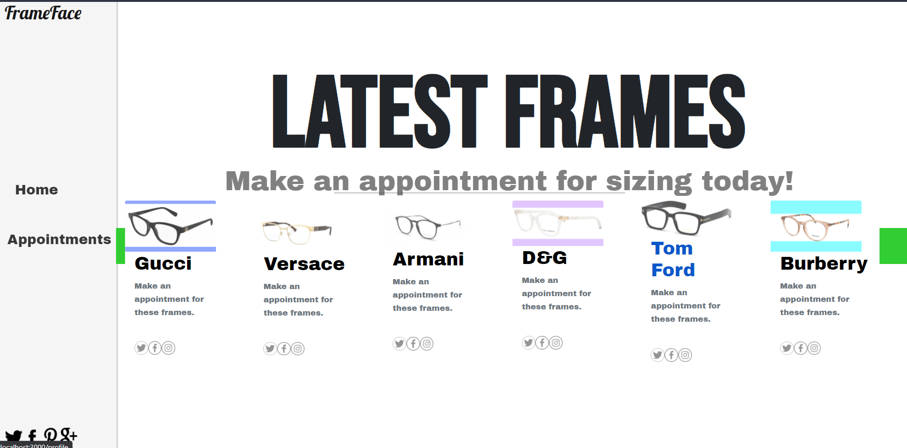

# Designer Frame Appointment App

> A simple app for making appointments to try on designer frames.

1. The user logs in the app with their username and password.
2. The user can create a new account.
3. After loging in, the user is presented with a list of designer frames.
4. When a user selects a particular frame, detailed information about that frame model is presented and the possibility to make an appointment to try on the frames in is presented.
5. The user can access a list of all of the appointments created by him/her.

## Built With

- Javascript, HTML, CSS.
- React & Redux.
- Webpack, Jest, Babel.

## Live Demo

[Movie App](https://movie-app-jpdf00.herokuapp.com/)

## Getting Started

To get a local copy up and running follow these simple steps.

- On the top of the page there is a green button labeled "Code"
- Click on the "Code" button.
- A Menu will appear. Click on the "Download Zip" menu option.
- Save the zip file on your computer.
- Extract the contents of the zip you just downloaded into a folder.

### Prerequisites

- nodeJS.
- A browser.

### Setup

- Open your command prompt.
- Go inside the folder you extracted from the zip file.
- Type `npm install`.

## Usage

- Open your command prompt.
- Go inside the folder you extracted from the zip file.
- Type `npm start` (this should open a page in your default browser and the page should load).

## Run tests

- Open your command prompt.
- Go inside the folder you extracted from the zip file.
- Type `npm run test`.

👤 **Paul Clue**

- GitHub: [@PaulClue](https://github.com/Paul-Clue)
- LinkedIn: [Paul Clue](https://www.linkedin.com/in/paul-clue/)

## 🤝 Contributing

Contributions, issues and feature requests are welcome!

## Show your support

Give a ⭐️ if you like this project!

## 📝 License

This project is [MIT](./LICENSE) licensed.